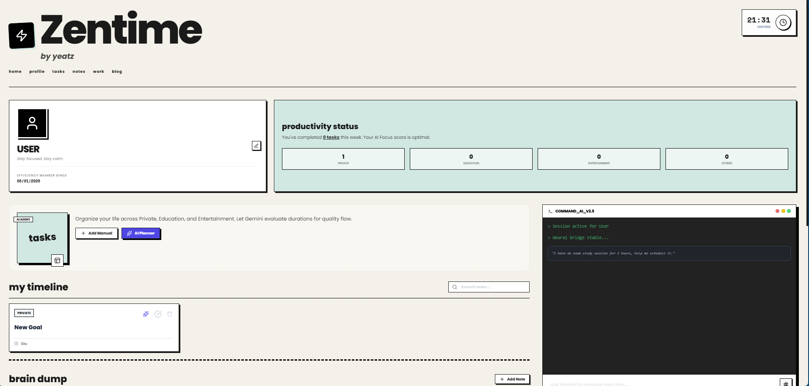

<div align="center">
  
  <h1>ZenTime AI</h1>
  <p><strong>AI-Powered Time Management & Productivity Tool</strong></p>
  <p>Transform your productivity with intelligent task scheduling and AI-powered insights</p>

  [](https://opensource.org/licenses/MIT)
  [](https://reactjs.org/)
  [](https://www.typescriptlang.org/)
  [](https://web.dev/progressive-web-apps/)
  [](https://astro.build/)

</div>

---

## ✨ Features

- **AI-Powered Scheduling**: Let Gemini AI optimize your daily tasks and schedule
- **Smart Task Management**: Categorize tasks by Private, Education, and Entertainment
- **Real-time Alarms**: Set reminders and get notified at the right time
- **Productivity Insights**: Visualize your focus balance with interactive charts
- **Brain Dump Notes**: Capture quick thoughts and ideas instantly
- **Slash Commands**: Quick shortcuts for common actions
- **PWA Support**: Install as an app on any device
- **Responsive Design**: Works perfectly on mobile, tablet, and desktop

## 🖼️ Showcase



## 🚀 Quick Start

### Prerequisites

- [Node.js](https://nodejs.org/) (v16 or higher)
- An API key from one of the supported providers:
  - [Gemini API Key](https://makersuite.google.com/app/apikey)
  - [OpenAI API Key](https://platform.openai.com/api-keys)

### Installation

1. Clone the repository:
   ```bash
   git clone https://github.com/yourusername/zentime.git
   cd zentime
   ```

2. Install dependencies:
   ```bash
   npm install
   ```

3. Set up environment variables:
   ```bash
   cp .env.example .env.local
   ```

   Then add your API key for your preferred provider:
   ```env
   # For Gemini (default):
   GEMINI_API_KEY=your_gemini_api_key_here

   # OR for OpenAI:
   OPENAI_API_KEY=your_openai_api_key_here

   # Optional: Specify which provider to use (defaults to 'gemini')
   AI_PROVIDER=gemini
   # or
   # AI_PROVIDER=openai
   ```

4. Run the development server:
   ```bash
   npm run dev
   ```

5. Open your browser and visit: `http://localhost:3000`

## 🎯 How to Use

### Task Management
- Click "Add Manual" to create tasks manually
- Use "AI Planner" to let AI optimize your schedule
- Categorize tasks as Private, Education, or Entertainment

### Slash Commands
- `/task [title] [category]` - Create a new task
- `/note [task name] [content]` - Add notes to a task
- `/alarm [task name] [HH:mm]` - Set an alarm
- `/optimize` - Let AI optimize your day

### Productivity Features
- Set reminders for important tasks
- Track your productivity with visual charts
- Use brain dump notes for quick thoughts
- Monitor your focus balance across categories

## 🛠️ Tech Stack

- **Frontend**: React 19, TypeScript
- **Styling**: Tailwind CSS with custom retro design
- **Icons**: Lucide React
- **Charts**: Recharts
- **AI Integration**: Multi-provider (Google Gemini, OpenAI)
- **PWA**: Service Worker for offline functionality
- **Build Tool**: Vite

## 📱 PWA Installation

ZenTime is built as a Progressive Web App (PWA), which means you can install it on your device just like a native app:

1. Open the app in your browser
2. Look for the "Install" button in your browser's address bar
3. Follow the prompts to install the app

## 🔧 Configuration

### Environment Variables

Create a `.env.local` file in the root directory:

```env
# For Gemini (default provider):
GEMINI_API_KEY=your_gemini_api_key_here

# OR for OpenAI:
OPENAI_API_KEY=your_openai_api_key_here

# Optional: Specify which provider to use (defaults to 'gemini')
AI_PROVIDER=gemini
# or
# AI_PROVIDER=openai
```

### Customization

- Modify the UI by editing `App.tsx`
- Adjust styling in `index.html` (tailwind styles are in the style tag)
- Update PWA settings in `manifest.json`
- Add support for additional AI providers in `services/aiService.ts`

## 🤝 Contributing

1. Fork the repository
2. Create a feature branch (`git checkout -b feature/amazing-feature`)
3. Commit your changes (`git commit -m 'Add some amazing feature'`)
4. Push to the branch (`git push origin feature/amazing-feature`)
5. Open a Pull Request

## 📄 License

This project is licensed under the [MIT License](LICENSE) - see the LICENSE file for details.

## 🌐 Landing Page

This repository also includes a beautiful landing page built with [Astro](https://astro.build/) located in the `landing/` directory. To run the landing page:

1. Navigate to the landing directory:
   ```bash
   cd landing
   ```

2. Install dependencies:
   ```bash
   npm install
   ```

3. Run the development server:
   ```bash
   npm run dev
   ```

4. Visit `http://localhost:4321` to view the landing page

## 🆘 Support

If you encounter any issues or have questions, please file an issue in the repository.

---

<div align="center">

### 💖 Like this project?

Give it a ⭐ if you found it helpful!

**Made with ❤️ by yeatz**

</div>
